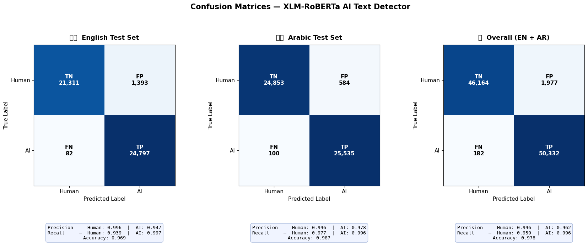
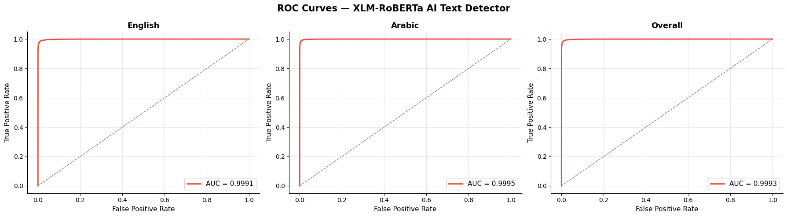
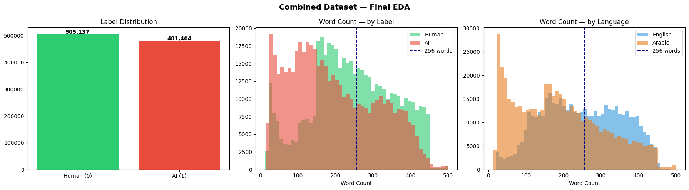

<div align="center">

# 🔍 AI Text Detector

**A bilingual AI-generated text detection API powered by XLM-RoBERTa**

Detect whether a given Arabic or English text is **human-written** or **AI-generated** with high accuracy and confidence scoring.

[](https://python.org)
[](https://fastapi.tiangolo.com)
[](https://pytorch.org)
[](https://huggingface.co/docs/transformers)
[](LICENSE)

</div>

---

## 📋 Table of Contents

- [Overview](#-overview)
- [Features](#-features)
- [Architecture](#-architecture)
- [Project Structure](#-project-structure)
- [Getting Started](#-getting-started)
- [API Documentation](#-api-documentation)
- [Model Details](#-model-details)
- [Chunking Strategy](#-chunking-strategy)
- [Configuration](#-configuration)
- [Notebooks](#-notebooks)
- [Results](#-results)
- [Tech Stack](#-tech-stack)

---

## 🧠 Overview

AI Text Detector is a production-ready REST API that classifies text as **human-written** (`real`) or **AI-generated** (`ai`). It leverages a fine-tuned **XLM-RoBERTa** model trained on a large-scale bilingual dataset covering both **Arabic** and **English** text.

The system is designed for real-world use cases such as:
- 📝 Academic integrity checks
- 📰 News authenticity verification
- 💬 Content moderation platforms
- 🔬 Research on AI-generated text

---

## ✨ Features

| Feature | Description |
|---------|-------------|
| 🌍 **Bilingual Support** | Supports both Arabic and English text detection |
| 🎯 **High Accuracy** | ~97% training accuracy with XLM-RoBERTa fine-tuning |
| 📊 **Confidence Scoring** | Returns a confidence score from 0 to 100 for every prediction |
| 📄 **Long Text Chunking** | Automatically splits long texts into overlapping chunks for analysis |
| 🌐 **Language Detection** | Auto-detects input language and rejects unsupported languages |
| ✅ **Input Validation** | Validates word count (minimum 20 words) before processing |
| ⚡ **GPU Acceleration** | Auto-detects CUDA and supports multi-GPU with DataParallel |
| 📖 **Interactive Docs** | Built-in Swagger UI at `/docs` for easy testing |
| 🔧 **Configurable** | All settings configurable via `.env` file |

---

## 🏗 Architecture

```
Client Request
      │
      ▼
┌─────────────┐
│   FastAPI    │  ← CORS enabled
│   Router     │
└──────┬──────┘
       │
       ▼
┌─────────────┐
│  Controller  │  ← Input validation, language detection
└──────┬──────┘
       │
       ▼
┌─────────────┐     ┌──────────────┐
│  Detector    │────▶│ XLM-RoBERTa  │  ← Fine-tuned model
│  (predict)   │     │   (512 tok)  │
└──────┬──────┘     └──────────────┘
       │
       ▼
┌─────────────┐
│  Response    │  ← { verdict, confidenceScore }
└─────────────┘
```

### Request Processing Pipeline

1. **Text Cleaning** → Remove newlines, extra whitespace
2. **Word Count Validation** → Reject texts with < 20 words
3. **Language Detection** → Accept only Arabic (`ar`) and English (`en`)
4. **Inference** → Single pass for short texts, chunked analysis for long texts
5. **Response** → Return `verdict` and `confidenceScore`

---

## 📁 Project Structure

```
AI-text-detector/
├── main.py                          # Application entry point (FastAPI + Uvicorn)
├── requirements.txt                 # Python dependencies
├── .env.example                     # Environment variables template
├── .gitignore                       # Git ignore rules
│
├── src/
│   ├── controllers/
│   │   └── detection_controller.py  # Business logic (validation, inference)
│   │
│   ├── models/
│   │   ├── ml/
│   │   │   └── detector.py          # AIDetector class (model loading & prediction)
│   │   └── schemas/
│   │       └── detection.py         # Pydantic request/response schemas
│   │
│   ├── routes/
│   │   └── detection_routes.py      # API endpoint definitions
│   │
│   ├── helpers/
│   │   └── config.py                # Centralized settings (Pydantic BaseSettings)
│   │
│   └── notebooks/
│       ├── arabic-dataset.ipynb     # Arabic dataset preparation & EDA
│       ├── english-dataset.ipynb    # English dataset preparation & EDA
│       └── final-notebook.ipynb     # Model training & evaluation
│
├── pipeline/
│   └── best_model/                  # Trained model weights (not in repo)
│       ├── config.json
│       ├── model.safetensors
│       └── tokenizer_config.json
│
├── docs/
│   └── figures/                     # EDA & evaluation plots
│
└── data/                            # Training datasets (not in repo)
    ├── ar/
    └── en/
```

---

## 🚀 Getting Started

### Prerequisites

- **Python** 3.10+
- **CUDA** (optional, for GPU acceleration)
- Trained model files in `pipeline/best_model/`

### 1. Clone the Repository

```bash
git clone https://github.com/ramezaboud/AI-text-detector.git
cd AI-text-detector
```

### 2. Create a Virtual Environment

```bash
python -m venv text_detector
```

**Activate it:**

```bash
# Windows (PowerShell)
text_detector\Scripts\activate

# Linux / macOS
source text_detector/bin/activate
```

### 3. Install Dependencies

```bash
pip install -r requirements.txt
```

### 4. Setup Environment Variables

```bash
cp .env.example .env
```

Edit `.env` with your configuration:

```env
# Paths
ENGLISH_DATA_PATH=data/en/final_english_ready.csv
ARABIC_DATA_PATH=data/ar/final_arabic_ready.csv
PIPELINE_DIR=pipeline/best_model
LOGS_DIR=logs

# Model
MODEL_NAME=xlm-roberta-base

# Training
BATCH_SIZE=8
MAX_EPOCHS=5
LR=2e-5
SAMPLE_SIZE=100000

# Misc
RANDOM_SEED=42
```

### 5. Add Model Files

Place your trained model files in `pipeline/best_model/`:

```
pipeline/best_model/
├── config.json
├── model.safetensors
└── tokenizer_config.json
```

> ⚠️ Model files are not included in the repository due to their large size (~1.1 GB).

### 6. Run the Server

```bash
python main.py
```

The API will be available at:

```
🌐 API:     http://127.0.0.1:8000
📖 Docs:    http://127.0.0.1:8000/docs
📋 ReDoc:   http://127.0.0.1:8000/redoc
```

---

## 📡 API Documentation

### Health Check

Check if the server and model are running.

```http
GET /api/health
```

**Response:**

```json
{
    "status": "ok",
    "model_loaded": true
}
```

---

### Detect Text

Analyze text to determine if it's AI-generated or human-written.

```http
POST /api/detect
Content-Type: application/json
```

**Request Body:**

```json
{
    "text": "Your text to analyze here..."
}
```

**Success Response (200):**

```json
{
    "verdict": "real",
    "confidenceScore": 95.55
}
```

| Field | Type | Description |
|-------|------|-------------|
| `verdict` | `string` | `"real"` (human-written) or `"ai"` (AI-generated) |
| `confidenceScore` | `float` | Confidence score from 0 to 100 |

**Error Responses:**

| Status | Reason | Example |
|--------|--------|---------|
| `400` | Text too short (< 20 words) | `"Text is too short. Please provide at least 20 words (got 5)."` |
| `400` | Unsupported language | `"Unsupported language 'fr'. This model only supports Arabic (ar) and English (en)."` |
| `400` | Undetectable language | `"Could not detect the language of the provided text."` |
| `500` | Model inference error | `"Model inference failed: ..."` |

---

### Example Usage

**cURL:**

```bash
curl -X POST http://127.0.0.1:8000/api/detect \
  -H "Content-Type: application/json" \
  -d '{"text": "Artificial intelligence has transformed the way we interact with technology in our daily lives. From virtual assistants to recommendation systems, AI is everywhere around us today."}'
```

**Python:**

```python
import requests

response = requests.post(
    "http://127.0.0.1:8000/api/detect",
    json={"text": "Your text to analyze here..."}
)
print(response.json())
# {"verdict": "real", "confidenceScore": 92.34}
```

**JavaScript:**

```javascript
const response = await fetch("http://127.0.0.1:8000/api/detect", {
    method: "POST",
    headers: { "Content-Type": "application/json" },
    body: JSON.stringify({ text: "Your text to analyze here..." })
});
const data = await response.json();
console.log(data);
// { verdict: "real", confidenceScore: 92.34 }
```

---

## 🧪 Model Details

| Property | Value |
|----------|-------|
| **Base Model** | [XLM-RoBERTa Base](https://huggingface.co/xlm-roberta-base) |
| **Architecture** | Transformer (Sequence Classification) |
| **Parameters** | ~278M |
| **Max Tokens** | 512 |
| **Languages** | Arabic, English |
| **Training Data** | 100,000 samples (balanced human/AI) |
| **Training Accuracy** | ~97% |
| **Optimizer** | AdamW (lr=2e-5) |
| **Epochs** | 5 |
| **Batch Size** | 8 |

### Training Data Sources

- **English**: Multi-domain dataset from News, Books, Scientific Abstracts, and Wikipedia
- **Arabic**: Curated Arabic text dataset with human and AI-generated samples
- **AI Sources**: GPT-3.5, GPT-4, and other LLM-generated text

---

## 📄 Chunking Strategy

For texts longer than **400 words**, the system automatically splits them into overlapping chunks for more accurate analysis.

### How It Works

```
Original Text (1000 words)
│
├── Chunk 1: words[0:400]      (400 words)
├── Chunk 2: words[300:700]    (400 words, 100-word overlap)
├── Chunk 3: words[600:1000]   (400 words, 100-word overlap)
│
▼ Run model on each chunk
│
├── Chunk 1 → verdict: ai,   confidence: 95%
├── Chunk 2 → verdict: ai,   confidence: 88%
├── Chunk 3 → verdict: real, confidence: 72%
│
▼ Aggregate
│
├── Verdict:    "ai"   (majority vote: 2/3 chunks = ai)
└── Confidence: 85.0%  (average: (95+88+72)/3)
```

### Configuration

| Setting | Default | Description |
|---------|---------|-------------|
| `CHUNK_SIZE` | 400 | Number of words per chunk |
| `CHUNK_OVERLAP` | 100 | Overlapping words between consecutive chunks |
| `MIN_WORDS` | 20 | Minimum word count to accept for analysis |

### Aggregation Method

- **Verdict**: **Majority Vote** — the final verdict is determined by the majority of chunks
- **Confidence**: **Average** — the confidence score is the mean across all chunks

> This approach is robust against outliers and provides a balanced assessment across the entire text.

---

## ⚙️ Configuration

All settings are managed through `src/helpers/config.py` and can be overridden via `.env` file.

| Setting | Type | Default | Description |
|---------|------|---------|-------------|
| `API_HOST` | `str` | `127.0.0.1` | Server bind address |
| `API_PORT` | `int` | `8000` | Server port |
| `PIPELINE_DIR` | `str` | `pipeline/best_model` | Path to trained model |
| `MODEL_NAME` | `str` | `xlm-roberta-base` | HuggingFace model name (for tokenizer) |
| `MIN_WORDS` | `int` | `20` | Minimum words required |
| `MAX_TOKENS` | `int` | `512` | Maximum tokens for tokenizer |
| `CHUNK_SIZE` | `int` | `400` | Words per chunk (for long texts) |
| `CHUNK_OVERLAP` | `int` | `100` | Overlap between chunks |
| `DEVICE` | `str` | Auto | `cuda` if GPU available, else `cpu` |

---

## 📓 Notebooks

The `src/notebooks/` directory contains the full data preparation and model training pipeline:

| Notebook | Description |
|----------|-------------|
| `arabic-dataset.ipynb` | Arabic dataset collection, cleaning, and exploratory data analysis |
| `english-dataset.ipynb` | English multi-domain dataset preparation with domain balancing |
| `final-notebook.ipynb` | Model fine-tuning, training loop, and evaluation metrics |

---

## 📊 Results

### Confusion Matrices

<div align="center">

</div>

### ROC Curves

<div align="center">

</div>

### Dataset Distribution

<div align="center">

</div>

---

## 🛠 Tech Stack

| Category | Technology |
|----------|------------|
| **Framework** | FastAPI |
| **ML Framework** | PyTorch |
| **Model** | XLM-RoBERTa (HuggingFace Transformers) |
| **Server** | Uvicorn (ASGI) |
| **Validation** | Pydantic |
| **Language Detection** | langdetect |
| **Data Processing** | Pandas, NumPy |
| **Visualization** | Matplotlib, Seaborn |

---

## 📄 License

This project is licensed under the MIT License.

---

<div align="center">

**Built with ❤️ using FastAPI and XLM-RoBERTa**

</div>
